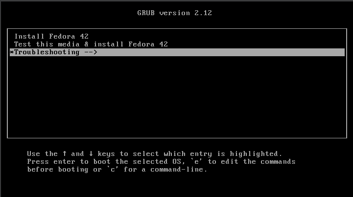
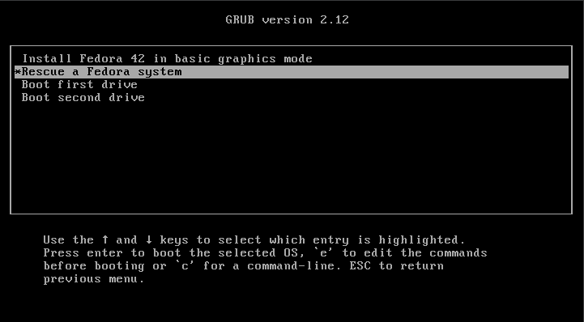
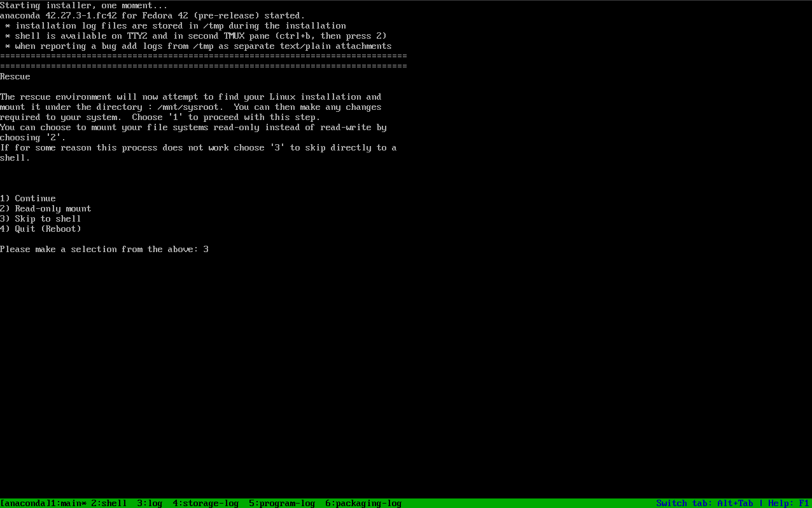

# INSTALLATION DE FEDORA 42

Documentation sur l'installation et la configuration de Fedora 42 avec un environement de bureau Gnome à partir d'une installation de [**Fedora Server 42**](https://fedoraproject.org/fr/server/download) : [Fedora-Server-netinst-x86_64-42_Beta-1.4.iso](https://download.fedoraproject.org/pub/fedora/linux/releases/test/42_Beta/Server/x86_64/iso/Fedora-Server-netinst-x86_64-42_Beta-1.4.iso)

## Téléchargement

Télécharger l'ISO Minimal sur [le site de Fedora](https://fedoraproject.org/fr/server/download) :

- [`Fedora-Server-netinst-x86_64-42_Beta-1.4.iso`](https://download.fedoraproject.org/pub/fedora/linux/releases/test/42_Beta/Server/x86_64/iso/Fedora-Server-netinst-x86_64-42_Beta-1.4.iso)

Pour confectionner le support d'installation, on utilisera un système Linux
existant. 

Insérer et identifier la clé USB :

```
# lsblk
```

Écrire le fichier ISO sur la clé USB :

```
# dd status=progress if=Fedora-Server-netinst-x86_64-42_Beta-1.4.iso of=/dev/sdX
```

> Attention à ne pas vous tromper de fichier de périphérique `/dev/sdX`!


## Réinitialiser le disque

Démarrer sur la clé en choisissant l'option `Rescue a Fedora System` via `Troubleshooting` :




Opter pour l'option `3) Skip to shell` et confirmer.


Passer du clavier QWERTY à un clavier AZERTY :
```
# loadkeys fr-latin1
```

Pour réinitialiser le disque, lancez `gdisk` et utilisez successivement les
options `x` et `z`.


## Partitionnement

Identifiez le disque à partitionner :

```
# lsblk
```

Exemple avec BIOS/MBR (`fdisk`) :

```
  Device     Boot    Start       End   Sectors  Size Id Type
  /dev/sda1  *        2048   2099199   2097152    1G 83 Linux
  /dev/sda2        2099200  10487807   8388608    4G 82 Linux swap
  /dev/sda3       10487808 117231407 106743600 50.9G 83 Linux
```

Exemple avec BIOS/GPT (`gdisk`) :

```
  Device        Start       End   Sectors  Size Type
  /dev/sda1      2048      4095      2048    1M BIOS boot
  /dev/sda2      4096   2101247   2097152    1G Linux filesystem
  /dev/sda3   2101248  10489855   8388608    4G Linux swap
  /dev/sda4  10489856 117229567 106739712 50.9G Linux filesystem
```

Exemple avec UEFI/GPT (`gdisk`) :

```
  Device        Start       End   Sectors  Size Type
  /dev/sda1      2048    206847    204800  100M EFI System
  /dev/sda2    206848   2303999   2097152    1G Linux filesystem
  /dev/sda3   2304000  10692607   8388608    4G Linux swap
  /dev/sda4  10692608 117229567 106536960 50.8G Linux filesystem
```

```
Number  Start (sector)    End (sector)  Size       Code  Name
   1            2048         1230847   600.0 MiB   EF00  EFI System Partition
   2         1230848         3327999   1024.0 MiB  EA00  
   3         3328000      1953523711   929.9 GiB   8304
```

| Type de partition     | Point de montage | Code `gdisk`  |
|-----------------------|------------------|---------------|
| Linux filesystem      | Tout             | `8300`        |
| EFI system partition  | Tout             | `ef00`        |
| BIOS boot partition   | Aucun            | `ef02`        |
| XBOOTLDR partition    | Tout             | `ea00`        |
| Linux x86-64 root (/) | /                | `8304`        |
| Linux swap            | [SWAP]           | `8200`        |
| Linux /home           | /home            | `8302`        |
| Linux /srv            | /srv             | `8306`        |
| Linux /var            | /var             | `8310`        |
| Linux /var/tmp        | /var/tmp         | `8311`        |
| Linux LVM             | Tout             | `8e00`        |
| Linux RAID            | Tout             | `fd00`        |
| Linux LUKS            | Tout             | `8309`        |
| Linux dm-crypt        | Tout             | `8308`        |

---

> Idéalement, créez une partition `swap` égale à la quantité de RAM disponible
> sur votre machine. Utilisez la commande `free -m` pour en savoir plus.

> **Swap sur ZRAM** :
> Fedora n'utilise pas de partition d'échange dédiée. Au lieu de cela, il utilise zram : un lecteur émulé qui utilise la RAM pour son stockage. L'échange basé sur la RAM est plus rapide que l'échange basé sur le disque, ce qui évite le ralentissement extrême du système et les perturbations qui peuvent survenir avec une partition d'échange traditionnelle.
> 
> Le lecteur zram est compressé pour utiliser efficacement la mémoire disponible et se voit attribuer de la mémoire de manière dynamique, ce qui signifie qu'il n'utilise la RAM système que lorsqu'un échange est nécessaire.

## Installation

- Démarrez sur le support d'installation.

- Sélectionnez la langue et le clavier.

- Optez pour le partitionnement manuel et formatez les partitions que vous
  venez de faire. Pour les étiquettes (*labels*) vous pouvez choisir `EFI`,
  `boot`, `swap` et `root`.

- Activez le réseau et vérifiez si vous obtenez bien une adresse IP. 

- Choisissez un nom d'hôte en remplacement de `localhost.localdomain`.

- Configurez le fuseau horaire.

- Désactivez Kdump (mécanisme de capture de plantage du noyau).

- Dans la sélection des paquets, optez pour **Installation minimale**.

- Définissez le mot de passe `root`.

- Créez un utilisateur normal, par exemple `allfab`.

- Cochez la case **Faire de cet utilisateur un administrateur**. L’utilisateur
  sera ajouté au groupe `wheel` et pourra se servir de la commande `sudo`.

- Lancez l'installation.


## Mise à jour

Au terme de l'installation, connectez-vous en tant que `root` et effectuez la
mise à jour initiale :

```
# dnf update -y
```

Redémarrez :

```
# reboot
```

## Installation de l'environnement graphique

Découverte des différents environnements de bureau disponible :
```bash
dnf group list --hidden | grep -i desktop
Mise à jour et chargement des dépôts :
Dépôts chargés.
basic-desktop                Basic Desktop                                      no
budgie-desktop               Budgie                                             no
budgie-desktop-apps          Budgie Desktop Applications                        no
cinnamon-desktop             Cinnamon                                           no
cosmic-desktop               COSMIC Desktop                                     no
cosmic-desktop-apps          COSMIC Desktop Supplementary Applications          no
critical-path-deepin-desktop Critical Path (Deepin desktop)                     no
deepin-desktop               Deepin Desktop Environment                         no
deepin-desktop-apps          Deepin Desktop Applications                        no
deepin-desktop-media         Media packages for Deepin Desktop                  no
deepin-desktop-office        Deepin Desktop Office                              no
desktop-accessibility        Desktop accessibility                              no
enlightenment-desktop        Enlightenment                                      no
gnome-desktop                GNOME                                              no
gnome-games                  Extra games for the GNOME Desktop                  no
guest-desktop-agents         Guest Desktop Agents                               no
kde-desktop                  KDE                                                no
lxde-apps                    Applications for the LXDE Desktop                  no
lxde-desktop                 LXDE                                               no
lxqt-apps                    Applications for the LXQt Desktop                  no
lxqt-desktop                 LXQt                                               no
mate-desktop                 MATE                                               no
miraclewm-desktop            Miracle Window Manager Desktop                     no
phosh-desktop                A phone/tablet UX environment                      no
sugar-desktop                Sugar Desktop Environment                          no
xfce-apps                    Applications for the Xfce Desktop                  no
xfce-desktop                 Xfce                                               no
```

### Information sur le groupe de packages :
```bash
dnf group info gnome-desktop
```
ou
```bash
dnf group info "GNOME"
```

### Installation de GNOME

Installer les groupes :
```bash
sudo dnf install @base-x @gnome-desktop
```

Ou en choississant ses paquets :
```bash
sudo dnf install -y \
  @base-x \
  @c-development \
  @core \
  @d-development \
  @development-tools \
  @guest-desktop-agents \
  @hardware-support \
  @multimedia \
  @networkmanager-submodules \
  @standard \
  adobe-source-code-pro-fonts \
  avahi \
  baobab \
  dconf \
  dconf-editor \
  desktop-backgrounds-gnome \
  evince \
  evince-djvu \
  f42-backgrounds-gnome \
  fedora-chromium-config-gnome \
  firefox \
  fprintd-pam \
  fros-gnome \
  gdm \
  git \
  glib-networking \
  gnome-abrt \
  gnome-autoar \
  gnome-backgrounds \
  gnome-backgrounds-extras \
  gnome-battery-bench \
  gnome-bluetooth \
  gnome-bluetooth-libs \
  gnome-browser-connector \
  gnome-calculator \
  gnome-calendar \
  gnome-characters \
  gnome-classic-session \
  gnome-classic-session-xsession \
  gnome-clocks \
  gnome-color-manager \
  gnome-connections \
  gnome-control-center \
  gnome-desktop3 \
  gnome-desktop4 \
  gnome-disk-utility \
  gnome-epub-thumbnailer \
  gnome-extensions-app \
  gnome-firmware \
  gnome-font-viewer \
  gnome-icon-theme \
  gnome-initial-setup \
  gnome-keyring \
  gnome-keyring-pam \
  gnome-logs \
  gnome-menus \
  gnome-monitor-config \
  gnome-nettool \
  gnome-online-accounts \
  gnome-power-manager \
  gnome-remote-desktop \
  gnome-screenshot \
  gnome-session \
  gnome-session-wayland-session \
  gnome-session-xsession \
  gnome-settings-daemon \
  gnome-shell \
  gnome-shell-extension-appindicator \
  gnome-shell-extension-background-logo \
  gnome-shell-extension-blur-my-shell \
  gnome-shell-extension-common \
  gnome-shell-extension-system-monitor \
  gnome-software \
  gnome-software-fedora-langpacks \
  gnome-system-log \
  gnome-system-monitor \
  gnome-terminal \
  gnome-terminal-nautilus \
  gnome-text-editor \
  gnome-themes-extra \
  gnome-tweaks \
  gnome-usage \
  gnome-user-docs \
  gnome-user-share \
  gvfs-afc \
  gvfs-afp \
  gvfs-archive \
  gvfs-fuse \
  gvfs-goa \
  gvfs-gphoto2 \
  gvfs-mtp \
  gvfs-smb \
  libgtop2-devel \
  librsvg2 \
  libsane-hpaio \
  lm_sensors \
  localsearch \
  loupe \
  mesa-dri-drivers \
  mesa-libEGL \
  ModemManager \
  nautilus \
  NetworkManager-adsl \
  NetworkManager-openconnect-gnome \
  NetworkManager-openvpn-gnome \
  NetworkManager-ppp \
  NetworkManager-pptp-gnome \
  NetworkManager-ssh-gnome \
  NetworkManager-vpnc-gnome \
  NetworkManager-wwan \
  PackageKit-command-not-found \
  PackageKit-gtk3-module \
  polkit \
  ptyxis \
  rygel \
  sane-backends-drivers-scanners \
  snapshot \
  sushi \
  systemd-oomd-defaults \
  tinysparql \
  unzip \
  vlc \
  xdg-desktop-portal \
  xdg-desktop-portal-gnome \
  xdg-desktop-portal-gtk \
  xdg-user-dirs \
  xdg-user-dirs-gtk
```

## Suppression de paquets non nécessaires
```bash
dnf remove -y gnome-tour
```

## Configuration de base
Installez Git :
```bash
dnf install -y git
```

Récupérez les fichiers de cet atelier pratique dans `/home/allfab` :
```bash
cd /home/allfab
git clone https://github.com/allfab/fedora-install-config.git
cd fedora-install-config
```

## Personnaliser le shell Bash
Installer le fichier `.bashrc` pour `root` .

```bash
sudo cp -vf conf/bash/bashrc-root /root/.bashrc
```

Installer le fichier `.bashrc` pour l'utilisateur initial (`allfab` dans
l'exemple) :

```bash
cp -vf conf/bash/bashrc-user /home/allfab/.bashrc
sudo chown allfab:allfab /home/allfab/.bashrc
```

Installer le fichier `.bashrc` pour les futurs utilisateurs :

```bash
sudo cp -vf conf/bash/bashrc-user /etc/skel/.bashrc
```

## Personnaliser l'éditeur Vim

Installer le fichier `.vimrc` pour `root` .

```bash
sudo cp -vf vim/vimrc /root/.vimrc
```

Installer le fichier `.vimrc` pour l'utilisateur initial (`allfab` dans
l'exemple) :

```bash
sudo cp -vf conf/vim/vimrc /home/allfab/.vimrc
sudo chown allfab:allfab /home/allfab/.vimrc
```

Installer le fichier `.vimrc` pour les futurs utilisateurs :

```bash
sudo cp -vf conf/vim/vimrc /etc/skel/.vimrc
```

## Configurer le dépôt de paquets EPEL

Le dépôt de paquets tiers EPEL (*Extra Packages for Enterprise Linux*) fournit
un grand nombre de paquets logiciels qui ne sont pas officiellement inclus dans
RHEL et ses clones.

Activer le dépôt EPEL :

```bash
sudo dnf install -y epel-release
```

Ce dépôt nécessite l'activation du dépôt CRB (*Code Ready Builder*) :

```bash
sudo /usr/bin/crb enable
```

Afficher la liste des dépôts configurés :

```bash
dnf repolist
```

## Configurer les dépôts de paquets RPMFusion

Les quatre dépôts RPMFusion fournissent des paquets potentiellement
problématiques en termes de licence (multimédia, paquets propriétaires, etc.)

Activer le dépôt RPMFusion Free : 

```bash
dnf install https://download1.rpmfusion.org/free/fedora/rpmfusion-free-release-$(rpm -E %fedora).noarch.rpm
```

Activer le dépôt RPMFusion Nonfree : 

```bash
dnf install https://download1.rpmfusion.org/nonfree/fedora/rpmfusion-nonfree-release-$(rpm -E %fedora).noarch.rpm
```

Afficher la liste des dépôts configurés :

```bash
dnf repolist
```

## Franciser le système

Il se peut que le système n'utilise pas la bonne locale :

```bash
localectl status
System Locale: LANG=C.UTF-8
    VC Keymap: ch-fr
   X11 Layout: ch
  X11 Variant: fr
```

Dans ce cas, on peut définir la langue française par défaut pour le système :

```bash
localectl set-locale LANG=fr_FR.UTF-8
```

Vérifier si tout s'est bien passé :

```bash
localectl status
System Locale: LANG=fr_FR.UTF-8
    VC Keymap: fr-fr
   X11 Layout: fr
  X11 Variant: fr
```

## Gérer les répertoires standards utilisateurs

```bash
rm -Rf /home/allfab/*
mkdir -pv /home/allfab/{downloads,documents,musics,images,videos,virtualization}
```

```bash
vi ~/.config/user-dirs.dirs

XDG_DOWNLOAD_DIR="$HOME/downloads"
XDG_DOCUMENTS_DIR="$HOME/documents"
XDG_MUSIC_DIR="$HOME/musics"
XDG_PICTURES_DIR="$HOME/images"
XDG_VIDEOS_DIR="$HOME/videos"
XDG_VIRTUALIZATION_DIR="$HOME/virtualization"
XDG_DESKTOP_DIR="$HOME/"
XDG_TEMPLATES_DIR="$HOME/"
XDG_PUBLICSHARE_DIR="$HOME/"
```

```bash
xdg-user-dirs-update
xdg-user-dirs-gtk-update
```

## Configuration du chargeur d'amorçage GRUB2 (GRand Unified Bootloader) 

On s'assure que le menu de démarrage de GRUB2 est toujours visible, ce qui peut être utile pour accéder à des options de démarrage avancées ou pour sélectionner un autre système d'exploitation si plusieurs sont installés :
```bash
sudo grub2-editenv unset menu_auto_hide
```

On modifie le temps d'affichage de menu GRUB2 :
```bash
sudo vi /etc/default/grub

GRUB_TIMEOUT=0
```

On s'assure que le menu de démarrage de GRUB2 est à jour et qu'il reflète l'état des options configurées ci-avant :
```bash
sudo grub2-mkconfig -o /boot/grub2/grub.cfg
```

## VSCode

Installation via les dépôts de Microsoft :
```bash
sudo rpm --import https://packages.microsoft.com/keys/microsoft.asc
echo -e "[code]\nname=Visual Studio Code\nbaseurl=https://packages.microsoft.com/yumrepos/vscode\nenabled=1\nautorefresh=1\ntype=rpm-md\ngpgcheck=1\ngpgkey=https://packages.microsoft.com/keys/microsoft.asc" | sudo tee /etc/yum.repos.d/vscode.repo > /dev/null
```

```bash
dnf check-update
sudo dnf install code
```

## dbeaver

```bash
wget https://dbeaver.io/files/dbeaver-ce-latest-stable.x86_64.rpm
sudo dnf install dbeaver-ce-latest-stable.x86_64.rpm
```

## Installation des extensions GNOME

- [`Color Picker`](https://extensions.gnome.org/extension/3396/color-picker/)
- [`Logo Menu`](https://extensions.gnome.org/extension/4451/logo-menu/)
- [`Space Bar`](https://extensions.gnome.org/extension/5090/space-bar/)
- [`Top Bar Organizer`](https://extensions.gnome.org/extension/4356/top-bar-organizer/)
- [`Vitals`](https://extensions.gnome.org/extension/1460/vitals/)
